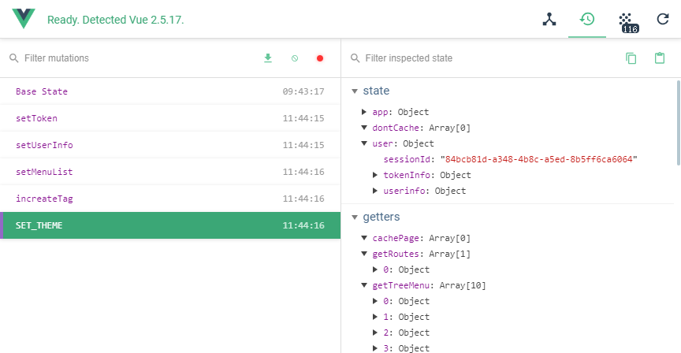

## 配置文件 config

### 环境参数配置文件
/config/dev.env.js  
/config/prod.env.js  
/config/test.env.js：  
根据不同环境，写入项目接口地址、网关、环境、名称等配置   

```js
{
    NODE_ENV: '"development"',
    PROJECT_NAME: '"电商平台"',
    BASE_URL: '"http://192.168.18.112:8080"',
    DEFAULT_GATEWAY:'"admin"',
    // 项目名称存入状态管理器vuex store
    website:()=>{
        return {
            title:'江南温泉'
        }
    }
}
```

### 在页面代码中使用环境变量
webpack.xxx.conf.js:
```js
plugins: [
    new webpack.DefinePlugin({
      'process.env': require('../config/dev.env')
    }),
]
```
?> webpack.DefinePlugin 将对应场景的配置加入到`process.env`中。你可以在应用的代码中这样访问它们：

```js

created() {
    console.log('process.env', process.env)
}
// result：
/*
{
   BASE_URL: "http://sendinfo-cs-java.tpddns.cn:12222"
   DEFAULT_GATEWAY: "admin"
   NODE_ENV: "development"
   PROJECT_NAME: "电商平台"
   website: ()=> {…}
   __proto__: Object
}
*/
   
```


### webpack基础配置 /config/index.js:
!> 配置中可以设置转发请求来解决开发中的接口跨域问题；  
也可以修改接口，允许跨域请求的方式解决；

?> 跨域复杂请求先发起一个options请求，返回200会再发起一个正常的请求


/config/index.js:
```js
module.exports = {
    // 开发模式配置
    dev: {
        // 静态文件路径配置
        assetsSubDirectory: 'static',
        assetsPublicPath: '/',
        
        // 代理配置，如果接口不支持跨域，需要通过代理转发请求。
        // 代理启动一个node服务，转发请求。
        // /api/v3在正常接口前存在有这个路径都会通过代理, /api/v3可以自定义修改
        proxyTable: {
            '/api/v3': {
                target: 'http://192.168.200.174:8080',
                secure: false,      // 默认情况下，不接受运行在 HTTPS 上，且使用了无效证书的后端服务器。如果你想要接受
                changeOrigin: true, // 是否跨域
                pathRewrite: {      // 路径重写 *^/api/v3*被重写成''，变成正确接口路径
                    '^/api/v3': ''
                }
            }
        },
        //可以简写成
        proxyTable: {
          "/api/v3": "http://192.168.200.174:8080"
        },
        
        // Various Dev Server settings
        //'localhost'运行无法使用ip访问,可使用0.0.0.0
        host: 'localhost', // can be overwritten by process.env.HOST; 
        port: 8081, // can be overwritten by process.env.PORT, if port is in use, a free one will be determined
        autoOpenBrowser: true,
        errorOverlay: true,
        notifyOnErrors: true,
        poll: false, // https://webpack.js.org/configuration/dev-server/#devserver-watchoptions-
    
        // 是否开启esLint代码规范
        useEslint: true,
        
        // https://webpack.js.org/configuration/devtool/#development
        devtool: 'source-map',
    },    
    // 生产模式webpack编译用配置
    build: {
        // Template for index.html
        // 编译生成首页index.html路径
        index: path.resolve(__dirname, '../dist/index.html'),
    
        // Paths
        // 静态文件编译生成路径
        assetsRoot: path.resolve(__dirname, '../dist'),
        assetsSubDirectory: 'static',
        assetsPublicPath: '/',
    }   
}
```

### Vue.js devtools插件(webkit内核和Firefox可安装)  
[chrome网上应用地址](https://chrome.google.com/webstore/detail/vuejs-devtools/nhdogjmejiglipccpnnnanhbledajbpd)  



## webpack配置
webpack.base.conf.js  
webpack.base.dev.js  
webpack.base.prod.js  
webpack.base.test.js  

开发项目启动命令 *npm start* 或者 *npm run dev*，使用webpack.base.dev.js 配置
/package.json:
````js
"scripts": {
    "dev": "webpack-dev-server --inline --progress --config build/webpack.dev.conf.js",
    "start": "npm run dev",                 // 等同npm run dev
    "lint": "eslint --ext .js,.vue src",    // 检查是否符合esLint规范
    "test": "node build/test-build.js",     // 使用测试配置文件进行编译
    "build": "node build/build.js"          // 使用生产配置编译项目
},
````

### webpack编译生产包
/build/build.js：

```js
const rm = require('rimraf')
const config = require('../config')
const webpack = require('webpack')
const webpackConfig = require('./webpack.prod.conf')
// 清空旧的静态文件；静态文件名称每次编译都会带上hash
rm(path.join(config.build.assetsRoot, config.build.assetsSubDirectory), err => {
    // 导入生产配置
    webpack(webpackConfig, (err, stats) => {})
})
```

### 静态文件build后生成名称规则  
/build/webpack.base.conf.js:
```js
{
    test: /\.(png|jpe?g|gif|svg)(\?.*)?$/,
    loader: 'url-loader',
    options: {
      limit: 10000,
      name: utils.assetsPath('img/[name].[hash:7].[ext]')
    }
}
```
