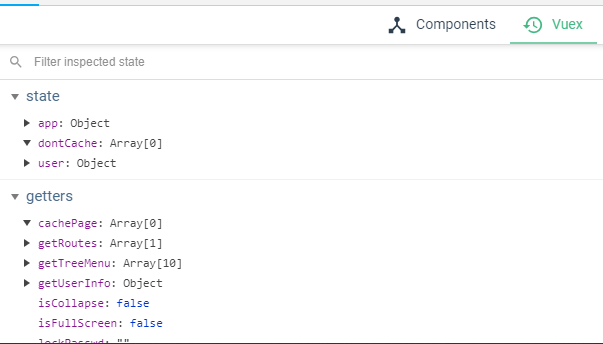

## 状态管理器
通过接口查询到的用户信息，网站信息和一些默认全局设置都可以存在state中；  
这样网站内部vue实例或者所有的子组件中都可以通过vuex去取到这些需要公用的信息。


[vuex官方文档](https://vuex.vuejs.org/zh/)

## vuex在vue实例中
/src/init.js:   
store写入vue实例中
```js
import store from 'sendinfo-admin-ui/src/store';
//初始化sessionid
// 执行/src/store/modules/user.js，mutations下的INIT_SESSIONID方法
// 生成uuid并存入到浏览器sessionStorage中 
store.commit('INIT_SESSIONID'); 

new Vue({
    el: config.el || '#app',
    // 把 store 对象提供给 “store” 选项，这可以把 store 的实例注入所有的子组件
    store,
    router,
    components: config.component || {App},
    template: config.template || '<App/>',
});
```

## 实例化 vuex
/src/store/index.js:
```js
import Vue from 'vue';
import Vuex from 'vuex';

import app from './modules/app';
import user from './modules/user';

// 必须在实例化之前调用Vue.use(vuex)
Vue.use(Vuex);

const store = new Vuex.Store({
    state: {
        dontCache: []  // 在这里定义你不想要缓存的页面的cacheName属性值
    },
    mutations: {
        increateTag(state, tagObj) {
            if (tagObj.meta && (tagObj.meta.cacheName) && !Util.oneOf(tagObj.meta.cacheName, state.dontCache)) {
                if(!Util.oneOf(tagObj.meta.cacheName, state.app.cachePage)){
                    state.app.cachePage.push(tagObj.meta.cacheName);
                    localStorage.cachePage = JSON.stringify(state.app.cachePage);
                }
            }
            state.app.pageOpenedList.push(tagObj);
        }
    },
    actions: {},
    modules: {
        app,
        user
    }
});
```

## modules
由于使用单一状态树，应用的所有状态会集中到一个比较大的对象。当应用变得非常复杂时，store 对象就有可能变得相当臃肿。

为了解决以上问题，Vuex 允许我们将 store 分割成**模块（module）**。每个模块拥有自己的 state、mutation、action、getter、甚至是嵌套子模块——从上至下进行同样方式的分割：

**所有以上面实例化的时候modules加载了app和user, 通过不同模块来区分**

## state
vuex中所有数据都最终保存在state中,是实际存储实际的地方。
项目中state保存了 app站点信息和userInfo 用户信息、token等；  
新项目可以根据需求再扩展

?> store 中的属性需要初始化好默认值

/store/index.js:
```js
state: {
    dontCache: []  // 在这里定义你不想要缓存的页面的cacheName属性值
}
```
/store/modules/app.js:
```js
state: {
    website,
    cachePage: [],
    opened: true,
    isFullScreen: false,
    theme: localStorage.get('theme') || '#409EFF',
    themeName:localStorage.get('themeName') || '',
    pageOpenedList: [otherRouter.children[0]],
    menuList: [],
    oldMenuList: null,
    messageCount: 0,
    lockPasswd:sessionStorage.get('lockPasswd') || '',
    isLock: sessionStorage.get('isLock') || false
}
```
/store/modules/user.js
```js
state: {
    //登录成功后的用户信息
    sessionId: sessionStorage.get('sessionId') || '', // 默认从浏览器session中获取。
    tokenInfo: localStorage.get('tokenInfo') || {}, // 默认从浏览器localStorage中获取。
    userinfo: localStorage.get('userinfo') || {},
}
```

## getter
有时候我们需要从 store 中的 state 中派生出一些状态。

例如state中有userinfo: 
```js
userinfo: {
    name: 'name',
    age: 10
}

// 在getter中写一个提取并返回age的方法
getters: {
    userAge: state => {
      return state.userinfo.age
    }
  }

// 在vue实例中使用：
this.$store.getters.userAge // 10
```

#### mapGetters 辅助函数
`mapGetters` 辅助函数仅仅是将 store 中的 getter 映射到局部计算属性：

```js
import { mapGetters } from 'vuex'

export default {
  // ...
  computed: {
  // 使用对象展开运算符将 getter 混入 computed 对象中
    ...mapGetters([
      'doneTodosCount',
      'anotherGetter',
      // ...
    ])
  }
}
```

## mutations
所有需要改变store值的方法都必须经过mutations；每个 mutation 都有一个字符串的 事件类型 (type) 和 一个 回调函数 (handler)。这个回调函数就是我们实际进行状态更改的地方，并且它会接受 `state` 作为第一个参数：

```js
INIT_SESSION: (state, value) => {
    // TODO()
}
```

Mutation 需遵守 Vue 的响应规则,所以：
1. 最好提前在你的 store 中初始化好所有所需属性。
2. 当需要在对象上添加新属性时，你应该
    * 使用 Vue.set(obj, 'newProp', 123), 或者 
    * 以新对象替换老对象。例如
    ```js
       state.obj = { ...state.obj, newProp: 123 }
    ```
    
?> Mutation 必须是同步函数; 需要使用异步函数使用action

#### 在内部实例中调用：
```js
this.$store.commit('mutations内子定义的方法名', '需要改变的state的值或包含值的一个对象、数组')
```
对象风格的提交方式:
```js
this.$store.commit({
  type: 'mutations内子定义的方法名',
  amount: '需要改变的state的值'
})
```
#### mapMutations
mapMutations 辅助函数将组件中的 methods 映射为 store.commit 调用（需要在根节点注入 store）
```js
import { mapMutations } from 'vuex'

export default {
  // ...
  methods: {
    ...mapMutations([
      'INIT_SESSION', // 将 `this.INIT_SESSION()` 映射为 `this.$store.commit('INIT_SESSION')`

      // `mapMutations` 也支持载荷：
      'incrementBy' // 将 `this.incrementBy(amount)` 映射为 `this.$store.commit('incrementBy', amount)`
    ]),
    // 在局部vue实例中重新命名方法
    ...mapMutations({
      initSessionStorage: 'INIT_SESSION' // 将 `this.initSessionStorage()` 映射为 `this.$store.commit('INIT_SESSION')`
    })
  }
}
```
[vuex-mutations官方文档](https://vuex.vuejs.org/zh/guide/mutations.html)

## actions
Action 类似于 mutation，不同在于：

* Action 提交的是 mutation，而不是直接变更状态; 再通过mutation去改变state。
* Action 可以包含任意异步操作。


Action 函数接受一个与 store 实例具有相同方法和属性的 context 对象  
例如： `logout(content){}` 或者 `logout({commit, state, getters}){}`

/src/store/modules/user.js:
```js
actions: {
    logout({commit}) {
        commit('logout')
        commit('clearAppData');
        return new Promise((resolve, reject) => {
            Vue.axios.post('/user/logout').then(() => {
                resolve();
            }).catch(function (error) {
                reject(error);
            });
        })
    }
}
```

Action 通过 store.dispatch 方法触发：
/src/core/axiox/index.js:
```js
switch (status) {
    // 接口状态403， 执行actions中的logout方法退出登录，接口返回成功后页面跳转到登录页面
    case 403:
        store.dispatch('logout').then(() => {
            window.location.href = '/login'
        });
        break;
}
```

#### mapActions 
使用 mapActions 辅助函数将组件的 methods 映射为 store.dispatch 调用（需要先在根节点注入 store）：

```js
import { mapActions } from 'vuex'

export default {
  // ...
  methods: {
    ...mapActions([
      'logout', // 将 `this.logout()` 映射为 `this.$store.dispatch('logout')`

      // `mapActions` 也支持载荷：
      'logout' // 将 `this.logout(id)` 映射为 `this.$store.dispatch('logout', id)`
    ]),
    ...mapActions({
      logoutRename: 'logout' // 将 `this.logoutRename()` 映射为 `this.$store.dispatch('logout')`
    })
  }
}
```

[vuex-actions官方文档](https://vuex.vuejs.org/zh/guide/actions.html)

